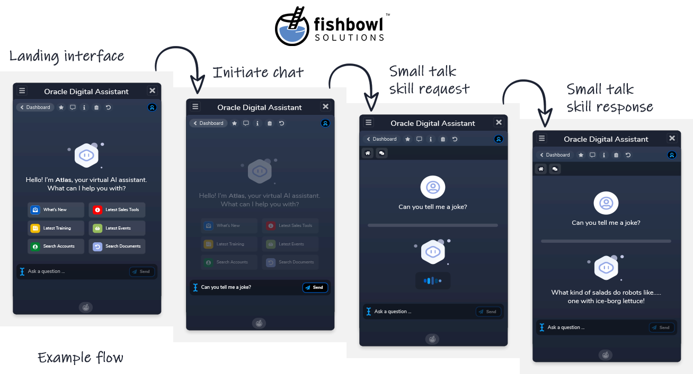

# 🤖 ODA Small Talk Skill

This is a community maintained Oracle Digital Assistant Skill. 

## Install

Clone, zip contents and import into ODA as a skill.  
If you download as a zip make sure to extract first and re-zip... 
as the root folder will be the name of the project - you will need to remove this so that the root content items are the chatbot skill data items.

## ODA Bot Config

Exit Prompt Confidence Threshold = 0  
Interrupt Prompt Confidence Threshold = 0  
Interrupt Message - blank  
Resume Message - blank  

## Contributors
[@gwronald](https://twitter.com/gwronald) Grant Ronald - Oracle  
[@JRSim_UIX](https://twitter.com/JRSim_UIX) John Sim - Fishbowl Solutions  
[@rsantrod](https://twitter.com/rsantrod) Ruben Rodriguez - Avanttic  
[@iamsoham](https://twitter.com/iamsoham) Soham Dasgupta - Capgemini  

## Todo

Review cleanup YAML - ie Pizza banking bot base with more generic responses.

## Release Notes

First release - 26/09/19

